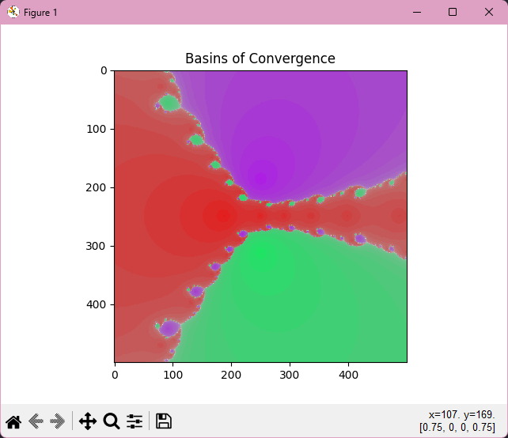
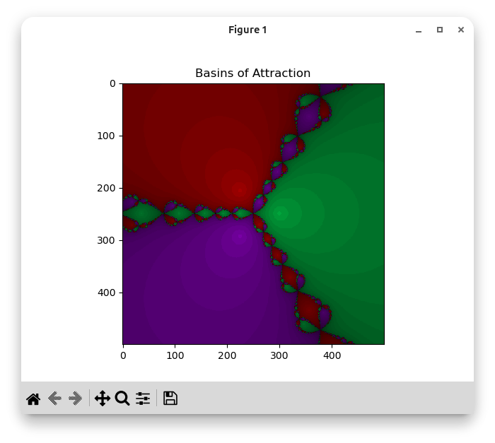
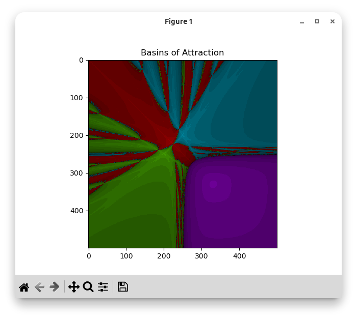

# newton_fractals

Displays the basins of attraction for polynomial roots using Newton's Method. Each pixel is an initial guess. Each color represents which root it converges to, brightness represents how fast (lighter is faster, darker is slower). In theory it would work to solve single-variable and multivariate systems of equations, but currently can only solve/plot 1 and 2 variable systems.

## setup

```
python -m venv .venv
source .venv/bin/activate   # windows: .venv\Scripts\activate
pip install -r requirements.txt
```

## running it

```
python plot.py
```

It'll ask for variable names then expressions one at a time. Type `done` when you're finished entering expressions.

**single variable:**
```
Enter variable names (e.g., 'x, y, z'): x
Enter expression (or 'done'): x**3 - 1
Enter expression (or 'done'): done
```

**multivariate:**
```
Enter variable names (e.g., 'x, y, z'): x, y
Enter expression (or 'done'): x**2 - y - 1
Enter expression (or 'done'): y**2 - x - 1
Enter expression (or 'done'): done
```

For single variable plots the x-axis is the real part and y-axis is the imaginary part of the initial guess, each pixel is x + yi on the complex plane. For multivariate, both axes are real and sweep the two variables over [-5, 5]. 

## examples


##### x^3 + x^2 + x + 1


##### x^3 - 1


##### x^2 - y - 1 and y^2 - x - 1
